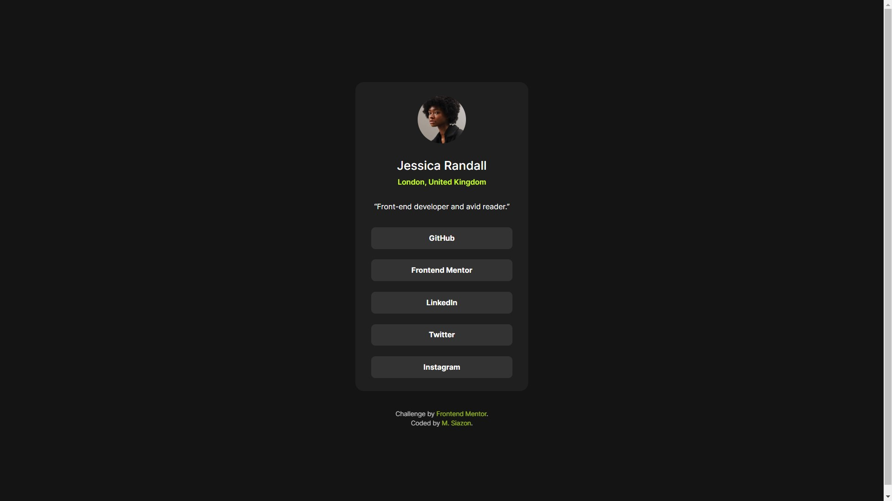
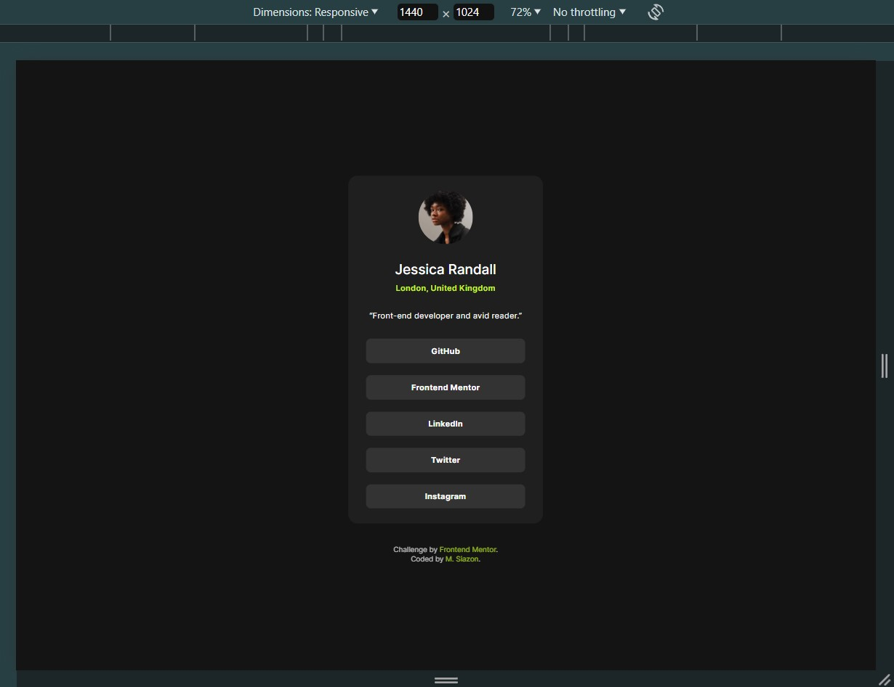
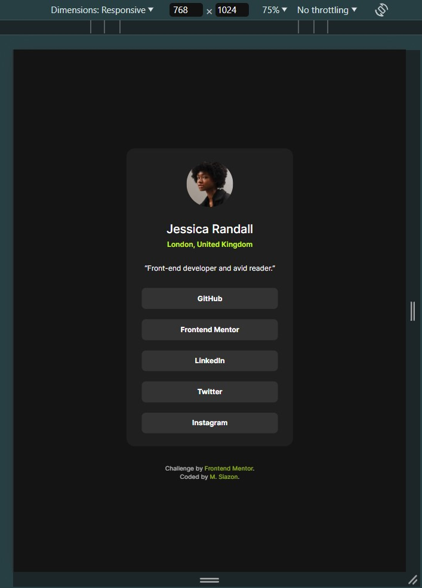
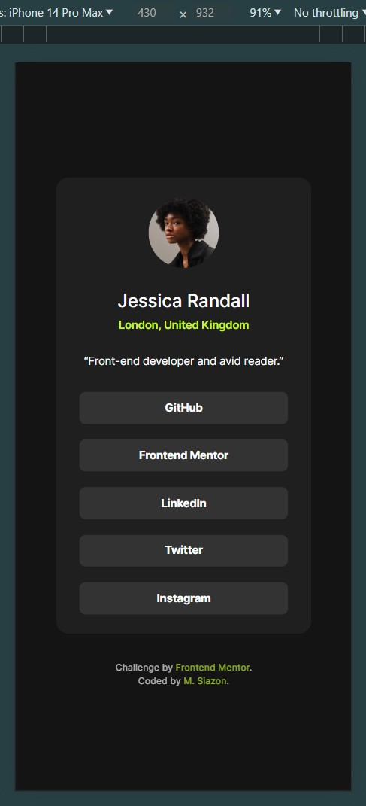
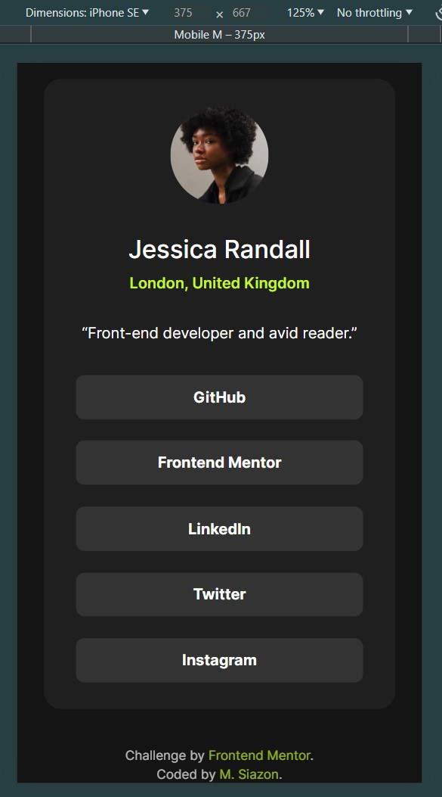

# Frontend Mentor - Social links profile

This is a solution to the [Social links profile coding challenge on Frontend Mentor](https://www.frontendmentor.io/solutions/responsive-social-links-profile-mobile-first-approach-and-uses-scss-45uffSOw54).

Frontend Mentor challenges help improve skills by building realistic projects.

## Table of contents:

- [Overview](#overview)
  - [The challenge](#the-challenge)
  - [Screenshot](#screenshots)
  - [Links](#links)
- [My process](#my-process)
  - [Built with](#built-with)
  - [What I learned](#what-i-learned)
- [Author](#author)
- [Acknowledgments](#acknowledgments)
- [Personal Notes](#notes)

## Overview:

### The challenge:

Users should be able to:

- View the optimal layout depending on their device's screen size
- See hover and focus states for all interactive elements on the page
- Get it looking as close to the design as possible.

 

Preview of initial design:

### Screenshots:

| Fullscreen View (Desktop)                             |
| ----------------------------------------------------- |
|  | 

| Animated Preview |
| ---------------------------------------------------------------------------------- |
|                                         |

 

**Note: This is a Mobile-First Approach & Wait for the GIF to load **

 

All viewports were included (except for the 4k view), in case the observer wishes to see the minor changes.

 

| Desktop View (1440px)                                | Laptop View (1024px)                                | Tablet View (768px)                                    |
| ---------------------------------------------------- | --------------------------------------------------- | ------------------------------------------------------ |
|  |  |  |

| Mobile L (430px)                                     | Mobile M (375px)                          |
| ----------------------------------------------------- | ---------------------------------------------------- |
|  |  |

### Links:

- Live Site URL: [Website Link - Click Me](https://mark-siazon.github.io/FM-Social-Links-Profile-Main/)
- Solution URL: [FrontEndMentor - Click Me](https://www.frontendmentor.io/solutions/responsive-social-links-profile-mobile-first-approach-and-uses-scss-45uffSOw54)

## My process:

### Built with:

- HTML5, CSS3, and SCSS/SASS
- Mobile-First Approach

### What I learned:

Recap over some of the major learnings while working through this project:

#### General things I've learned:

- Review of HTML & CSS, CSS Flex Layout
- Make use of SASS to make much more clean and organized styles
- Dynamic class that has the same style to avoid redundancy
- Less class and keep HTML Structure as simple as possible

## Author:

- Github - [@Iron-Mark](https://github.com/Iron-Mark)
- Github - [@Mark-Siazon](https://github.com/Mark-Siazon)
- Frontend Mentor - [@Iron-Mark](https://www.frontendmentor.io/profile/Iron-Mark)
  - _(The Assets used in this project is originally from FrontendMentor)_

## Acknowledgments:

- I would like to acknowledge the hard work and dedication I put into this project while injured, yet I'm building this project with a right wrist sprain.
- I am grateful for my friends and those who motivate me to push through and not settle for relaxation.
- I hope that this website serves its intended purpose. Thank you!

 

### Next Action (Soon):
- [ ] Add some Javascript Functionalities
- [ ] Create my own modified version of this project.
- [ ] TBA...

## Notes:

- I would be happy to receive comments, criticism, and such that could improve the website:
  - Cleaner Code
  - Better Practice/Approach to making this website.
- Feel free to approach and contact me :>
  - _Jun 28, 2024 (Replicate design in Figma)_
  - _Jun 29, 2024 **Stopped for 1 day**_
  - _Jun 30, 2024 (Initial Coding  + Finalize Styles)_
  - _Jul 1, 2024 (Documentation)_
